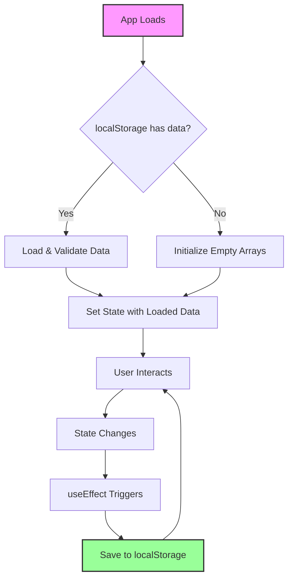

# Data Persistence Implementation Plan for ADHD Cleaning Companion

## Overview
This document outlines the implementation plan for adding localStorage-based data persistence to the ADHD Cleaning Companion application. The goal is to ensure that users' tasks and sensory moments are saved and persist across browser sessions.

## Architecture Decision
**Storage Solution**: localStorage
- **Rationale**: Simple, browser-based, no backend required, synchronous API, perfect for this use case
- **Data Format**: JSON strings
- **Storage Keys**: 
  - `adhddd_tasks` - for cleaning tasks
  - `adhddd_sensoryMoments` - for sensory tracking data

## Implementation Plan

### Phase 1: Saving State to localStorage

#### Task 1.1: Create useEffect for tasks
- **Location**: `App.tsx` (after state declarations)
- **Implementation**:
```typescript
useEffect(() => {
  try {
    localStorage.setItem('adhddd_tasks', JSON.stringify(tasks));
  } catch (e) {
    console.error('Failed to save tasks to localStorage:', e);
  }
}, [tasks]);
```

#### Task 1.2: Create useEffect for sensoryMoments
- **Location**: `App.tsx` (after tasks useEffect)
- **Implementation**:
```typescript
useEffect(() => {
  try {
    localStorage.setItem('adhddd_sensoryMoments', JSON.stringify(sensoryMoments));
  } catch (e) {
    console.error('Failed to save sensory moments to localStorage:', e);
  }
}, [sensoryMoments]);
```

### Phase 2: Loading State from localStorage

#### Task 2.1: Modify useState for tasks
- **Location**: `App.tsx:25`
- **Current**: `const [tasks, setTasks] = useState<Task[]>([]);`
- **New Implementation**:
```typescript
const [tasks, setTasks] = useState<Task[]>(() => {
  try {
    const savedTasks = localStorage.getItem('adhddd_tasks');
    if (savedTasks) {
      const parsed = JSON.parse(savedTasks);
      // Basic validation
      if (Array.isArray(parsed)) {
        return parsed;
      }
    }
  } catch (e) {
    console.error('Failed to load tasks from localStorage:', e);
  }
  return [];
});
```

#### Task 2.2: Modify useState for sensoryMoments
- **Location**: `App.tsx:39`
- **Current**: `const [sensoryMoments, setSensoryMoments] = useState<SensoryMoment[]>([]);`
- **New Implementation**:
```typescript
const [sensoryMoments, setSensoryMoments] = useState<SensoryMoment[]>(() => {
  try {
    const savedMoments = localStorage.getItem('adhddd_sensoryMoments');
    if (savedMoments) {
      const parsed = JSON.parse(savedMoments);
      // Basic validation
      if (Array.isArray(parsed)) {
        return parsed;
      }
    }
  } catch (e) {
    console.error('Failed to load sensory moments from localStorage:', e);
  }
  return [];
});
```

## Data Flow Diagram



## Error Handling Strategy

1. **Storage Quota Exceeded**: Wrap all localStorage operations in try-catch blocks
2. **Corrupted Data**: Validate parsed JSON is an array before using
3. **Missing Data**: Return empty arrays as fallback
4. **Console Logging**: Log errors for debugging but don't crash the app

## Testing Considerations

1. **Manual Testing Steps**:
   - Create tasks and reload page → tasks should persist
   - Log sensory moments and reload → moments should persist
   - Clear localStorage manually → app should handle gracefully
   - Fill localStorage to quota → should log error but continue

2. **Edge Cases to Test**:
   - Browser with localStorage disabled
   - Private/Incognito mode (may have restrictions)
   - Multiple tabs open (localStorage is synchronous)

## Future Enhancements (Not in Current Scope)

1. **Data Migration**: Version tracking for schema changes
2. **Export/Import**: Allow users to backup their data
3. **Compression**: Compress data if approaching quota limits
4. **IndexedDB**: For larger data storage needs
5. **Cloud Sync**: Optional server-side persistence

## Implementation Order

1. Implement loading from localStorage (Phase 2)
2. Implement saving to localStorage (Phase 1)
3. Test thoroughly
4. Deploy

This order ensures that even if saving has issues, we don't lose any existing persisted data.

## Success Criteria

- ✅ Tasks persist across page reloads
- ✅ Sensory moments persist across page reloads
- ✅ No errors thrown when localStorage is unavailable
- ✅ Graceful handling of corrupted data
- ✅ No performance impact on app responsiveness